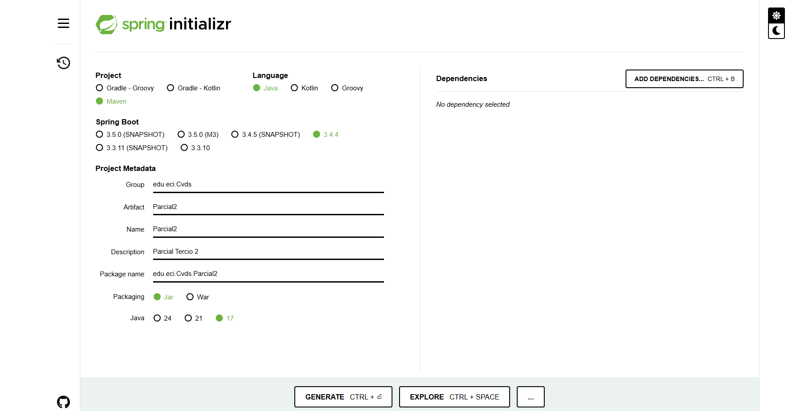
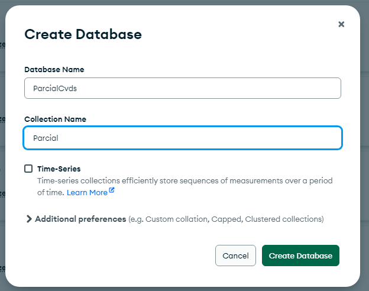
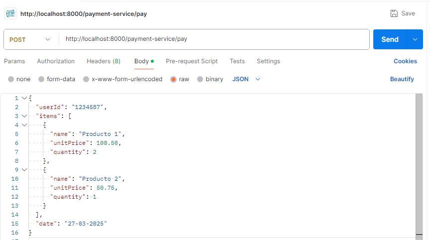
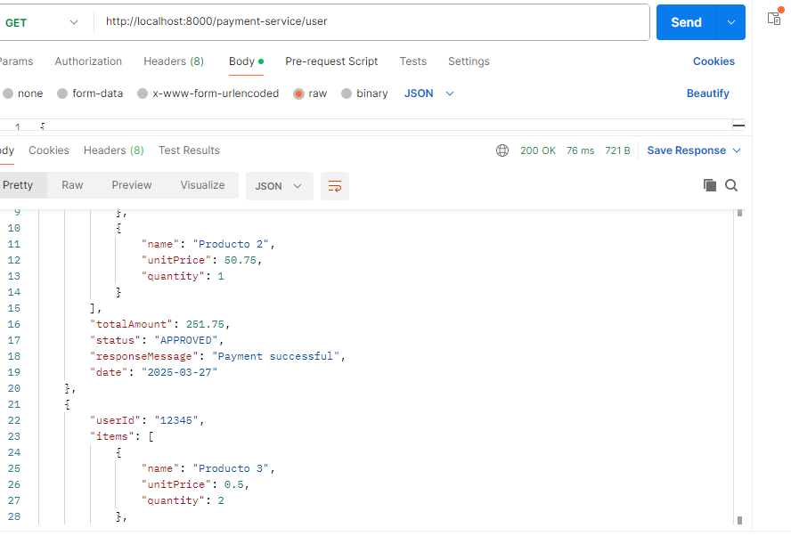
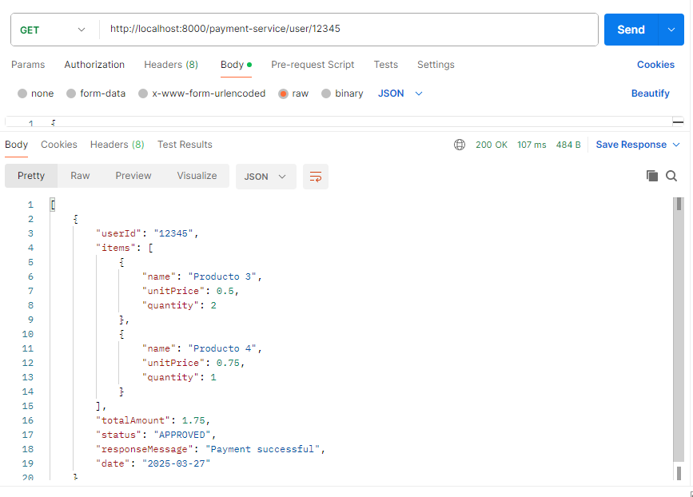

# CvdsParcial2
PARCIAL CICLO VIDA DEL DESARROLLO DE SOFTWARE SEGUNDO TERCIO
1)Lo primero es crear un proyecto, osea el Scaffolding y para ello usamos SpringInitializer

2)Creamos una base de datos en mongoDB

3)Probamos con postamant que podemos crear usuarios y y su compra 

4)Vemos que se creo de manera correcta

5)Probamos el otro metodo que es GET, para obtener todos los registros

6)Probamos el otro metodo de GET que es con el usuario ID

7)Dezplegamos el back con ayuda de Azure Devops

8)Conectamos la Web que nosotros creamos con Nuestro gitHub

9)Se logro desplegar de manera correcta 

Como Funciona 

El usuario debe de ingresar su ID que puede ser culquier identificador como su numero de c.c, despues tiene que ingresar los items que desea, y con estos items su precio, y cantidad, despues el usuario deberia de ingresar el Total Amount, si no coinciden, le muestra un estado de que fue "Declined" con un mensaje de "Invalid total amount", eso es para crear un una compra, pero si desea ver su compra o registro, accede a la otra opcion la cual solo debe de digitar su ID y le mostra el o los registros que tenga 

